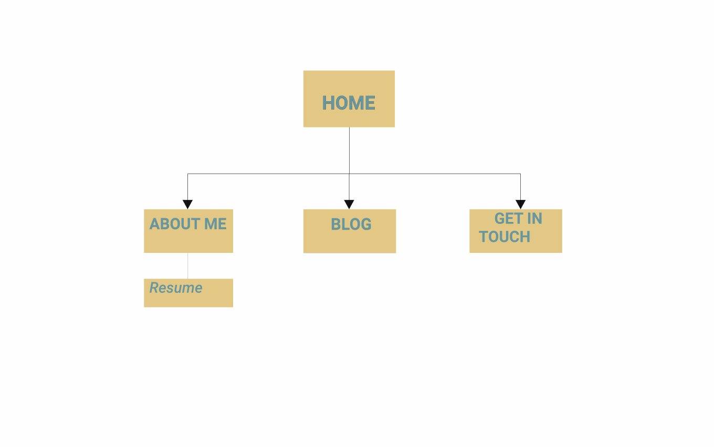
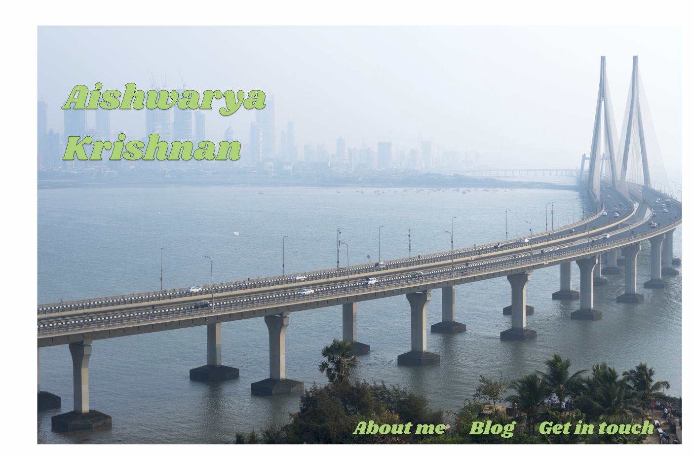
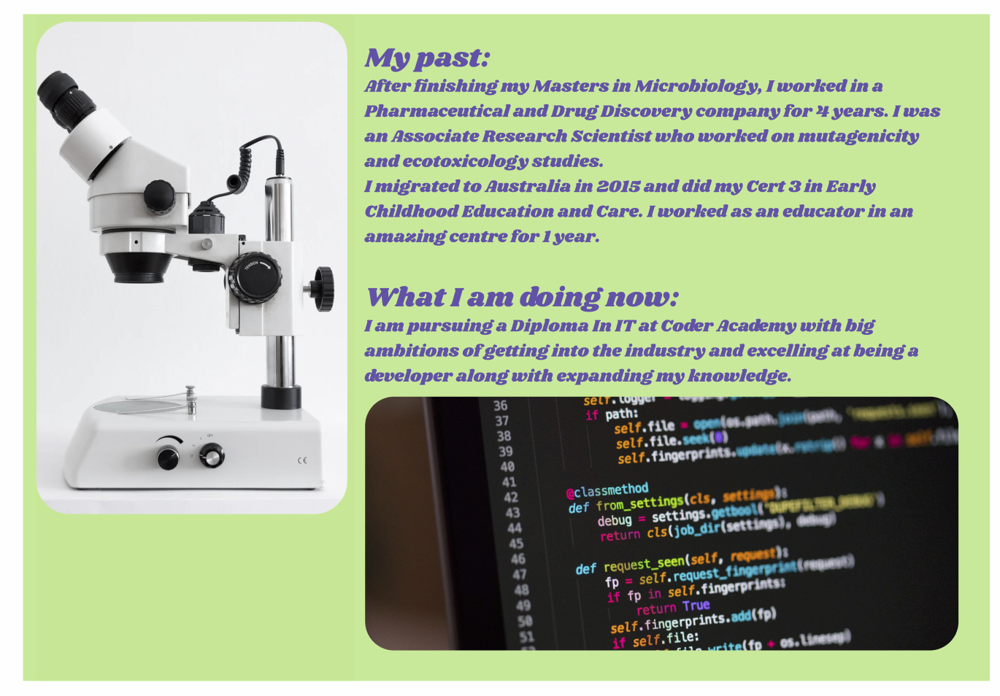
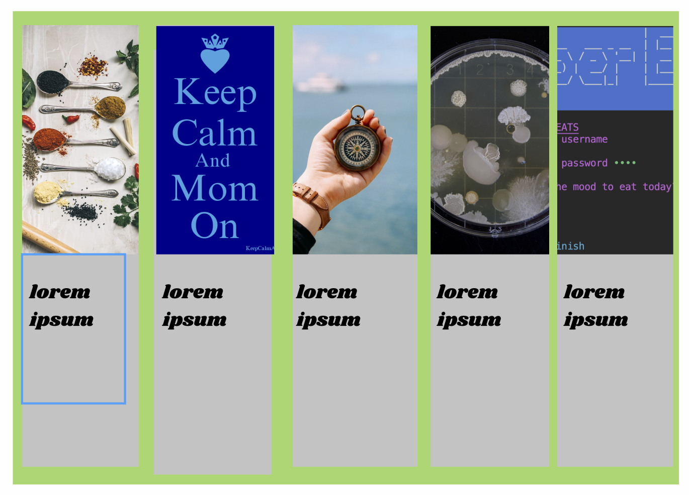
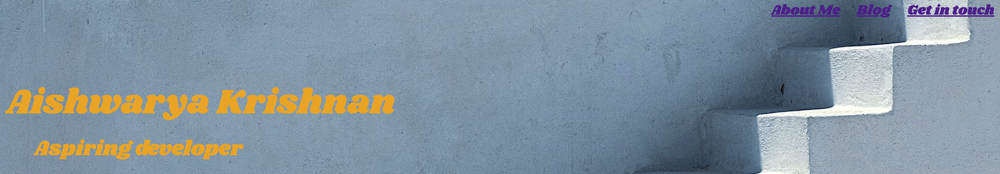

* Link to website: https://cocky-pare-0b5a2b.netlify.com
 

* Link to GitHub: https://github.com/ash-krish/portfolio
 

* Purpose of the portfolio website:
It is an online showcase of my skills, a way to highlight my abilities and accomplishments to future employers. As a student who wishes to join the workforce, it gives me an opportunity to visually showcase my experience in coding, prove my technical knowledge and highlight my best work to the employers out there. 
 

* Functionality/Features:
 1) Navigation bar - It has the navigation buttons which help in accessing the other 3 pages - About me, Blog and Contact from the Home page. The pages are also inter-accessible, meaning they can be accessed from any page. Eg: Home page to Contact page, Contact page to About me, Blog page to Homepage etc. 

 2) Contact form: This form is to initiate interaction with users who want to get in touch with me after going through my portfolio. It allows for input of their name, email id, phone number and an enquiry message, which will be sent to my email address when they fill in the details and click the submit button. The Submit button isnt functional now but with further modifications using JavaScript, I can make it work in future.

 3) Links: On the Contact and About me page, there are GitHub and LinkedIn icons placed so the user can view additional details about myself on these accounts. The about me page also has a 'resume' link, which when clicked by the user, takes them to a PDF page of my resume.

 4) Images: I have used a background image on almost all pages to bring some colour and contrast to the home page.

 5) Blog page: The blog page is a feature with a colourful background image to make it look more interesting and playful. I inserted 5 blog posts on the page using flex inside which the text and image are flex-wrapped. The scroll option on the page with no-repeat of the background image gives a contrast to the colourful page on the top half of the page.

 6) Hover: The hover feature which changes color and opacity on the Github and LinkedIn icons makes it look animated when the user hovers their cursor on the icons.
 

* Sitemap:

 

* Screenshots:

 

* Target audience:
Employers that are looking to hire junior developers, students looking for examples to create their portfolio, or other people from tech wanting some information about me  can be considered the target audience for this portfolio. 
 

* Tech stack:
A Tech stack is the underlying elements of a web/mobile application. It can be a combination of programming languages, tools and frameworks to create the application. 
In this portfolio, I have used HTML and CSS and I have deployed this portfolio on Netlify.